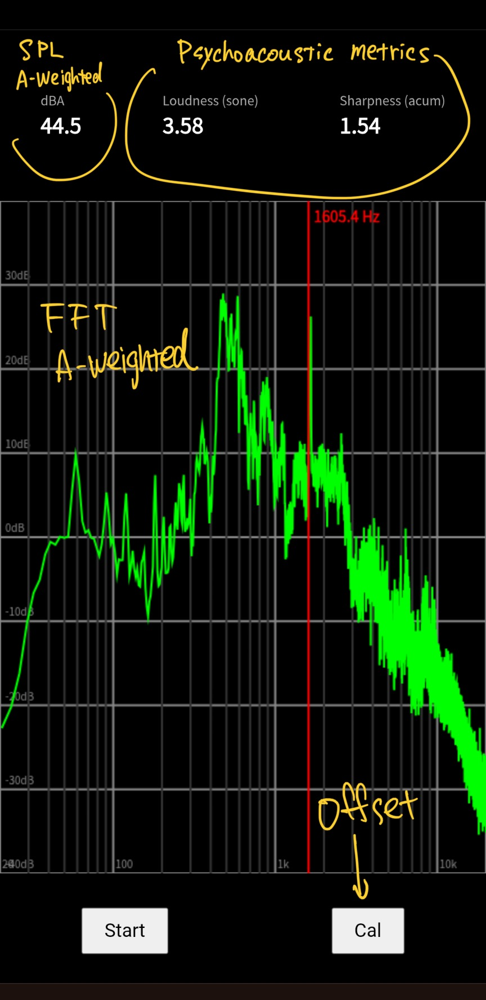

# Psychoacoustic Sound Level Meter (PWA)
https://moguramode.github.io/Psychoacoustic-Sound-Level-Meter/

A browser-based sound analysis tool implementing key psychoacoustic metrics.
Runs entirely on WebAudio API and works as a Progressive Web App (PWA).
Please note that this tool does not perform precise or professional-grade calculations.
This project was created for my personal use. You are free to use it if you find it helpful,
but I do not provide support or maintenance. Features may change or stop working without notice.

**Features**
- Sound Pressure Level (dBA), A-weited
- Loudness (sone)
- Sharpness (acum), Aures
- Real-time FFT analysis, A-weighted
- Microphone calibration offset

**Techinical overview**
- **Loudness, Sharpness** 
  Based on Zwicker Loudness and Aures Sharpness. Please note that the calculation is simplified and does not fully comply with ISO 532-1.
- **Calibration** 
  Calibration offset is set to 110dB. A common level for typical smartphone or PC microphones are 90 ~ 120dBA. Actual sensitivity varies significantly by device.

**Notes**
This code sets {echoCancellation, noiseSuppression, autoGainControl} to "false," but noise cancellation may be forced on some systems. In this case, please disable the noise cancellation feature in your device settings.

# 心理音響 騒音計（PWA）
https://moguramode.github.io/Psychoacoustic-Sound-Level-Meter/

心理音響評価量に対応した騒音計です。WebAudio APIを使ったプログレッシブウェブアプリなので、パソコンやスマートフォンのほとんどのブラウザで使用できるほか、アプリとしてスマートフォンにインストールする事も出来ます。
精密な測定や専門用途を目的としたものではありませんのでご注意ください。
本アプリは個人用として作成したものですが、必要であれば自由に利用して構いません。ただし、サポートやメンテナンスは行いませんのでご了承ください。

**機能**
- A特音圧 (dBA)
- ラウドネス (sone)
- シャープネス (acum), Aures法
- リアルタイムFFT表示 A特性
- マイク補正

**技術解説**
- **ラウドネス、シャープネス** 
  Zwickerラウドネス, Auresシャープネスを基本としていますが、計算を簡略化しているためISO532-1に厳密に準拠はしていません。
- **補正** 
  初期値に110dBのオフセットを設定しています。これはWebAudioの仕様が-100dB～0dBとなっているためです。実際の値は機種によって大きく異なる場合があります。一般的なPCやスマートフォンのマイクは90～120dB程度です。

**備考**
コードで echoCancellation, noiseSuppression, autoGainControl を false に設定していますが、この設定をしていても強制的にノイズキャンセルを付与する機器を確認しています。その場合は機器の側でノイズキャンセル機能を解除してください。

